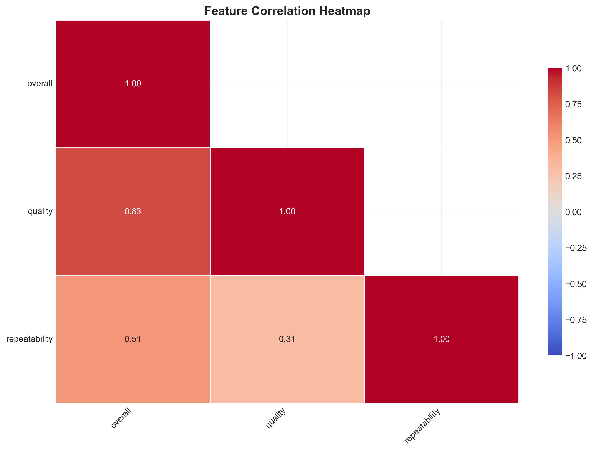
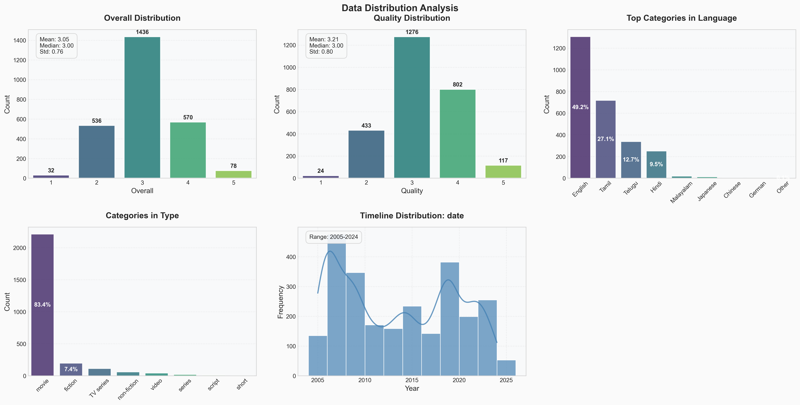
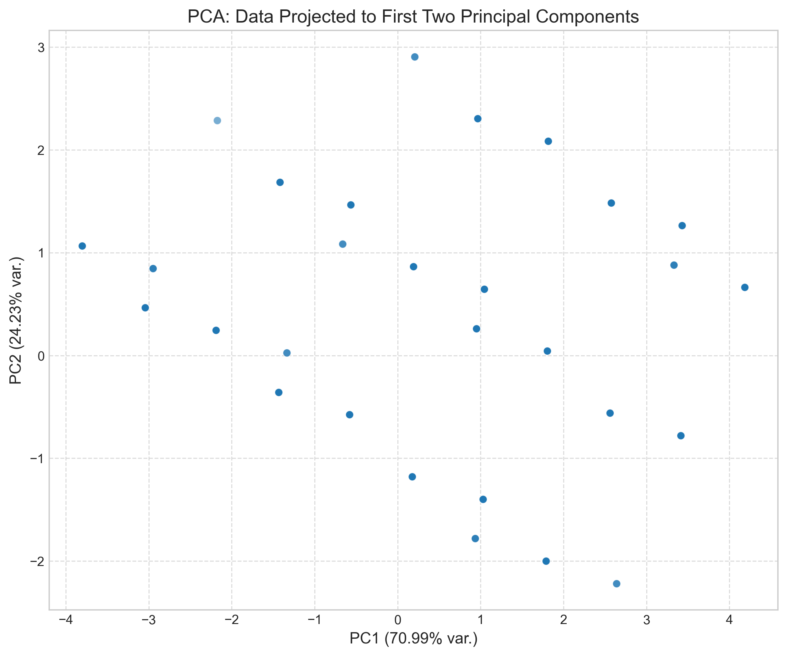

# Media Consumption Analysis Report

## 1. Introduction & Data Overview

This report presents an analysis of the 'data/media.csv' dataset, which contains information on media consumption habits. The dataset comprises **2652 rows and 8 columns**, providing a substantial foundation for understanding user preferences and content characteristics. The dataset exhibits a high level of completeness, with an overall completeness rate of **98.30%**. However, some columns, specifically 'date' and 'by', contain missing values, which will be addressed in the analysis. The columns include: `date`, `language`, `type`, `title`, `by`, `overall`, `quality`, and `repeatability`.

## 2. Analytical Journey

Our analytical journey began with an initial exploration phase, followed by advanced analysis techniques and AI-assisted insights.

### 2.1 Initial Exploration

*   **Basic Statistics:** We started by calculating descriptive statistics for each column. This provided a high-level overview of the data, including measures of central tendency, dispersion, and frequency. Key observations include:
    *   The 'type' column is dominated by 'movie' entries.
    *   The average 'overall' rating is approximately 3.05, with a standard deviation of 0.76.
    *   The 'repeatability' score is relatively low, averaging around 1.49.
*   **Missing Values:** We identified missing values in the 'date' (99 missing values) and 'by' (262 missing values) columns. These missing values were noted for potential imputation or handling in subsequent analysis steps.

### 2.2 Advanced Analysis

*   **Outlier Detection:** We employed outlier detection techniques to identify potentially anomalous data points. This revealed **261 potential outliers**, representing approximately 9.84% of the dataset. These outliers could indicate unusual user behavior or data entry errors.
*   **Clustering:** We applied K-means clustering to segment the data into distinct groups based on their characteristics. The clustering results yielded five clusters with the following distributions:
    *   Cluster 0: 649 samples (24.47%)
    *   Cluster 1: 568 samples (21.42%)
    *   Cluster 2: 157 samples (5.92%)
    *   Cluster 3: 801 samples (30.20%)
    *   Cluster 4: 477 samples (17.99%)
    These clusters may represent different user segments or content categories.
*   **PCA Analysis:** We performed Principal Component Analysis (PCA) to reduce the dimensionality of the data and identify the most important features. The first two principal components explained 70.99% and 24.23% of the variance, respectively. A PCA plot was generated at `media/pca_plot.png`, visualizing the data in the reduced dimensional space.

### 2.3 AI-Assisted Insights

To further enrich our analysis, we leveraged AI-assisted insights to suggest additional analysis techniques and visualizations. The AI recommended the following:

*   **Sentiment Analysis of Titles by Language:** This analysis aims to uncover potential correlations between language and sentiment expressed in media titles.
*   **Analysis of 'by' column:** Analyzing the 'by' column, which contains actor/creator information, can provide insights into popular figures and their impact on ratings.
*   **Trend Analysis of Ratings Over Time:** Examining rating trends over time can reveal shifts in audience preferences or content quality.
*   **Distribution of Overall Ratings by Type:** Comparing the distribution of overall ratings across different media types (e.g., movies vs. TV shows) can highlight potential differences in perceived quality.
*   **Count of Reviews by Language:** Analyzing the distribution of reviews across different languages can provide insights into the demographic representation in the reviews.

## 3. Key Findings

*   The dataset contains a significant number of movies compared to other media types.
*   Outlier detection identified a notable percentage of potential anomalies, warranting further investigation.
*   Clustering revealed five distinct segments within the data, potentially representing different user groups or content categories.
*   PCA analysis highlighted the importance of the first two principal components in explaining the variance in the data.

## 4. Recommendations & Next Steps

Based on our analysis, we recommend the following actionable steps:

*   **Address Missing Values:** Implement appropriate imputation techniques to handle missing values in the 'date' and 'by' columns.
*   **Investigate Outliers:** Conduct a detailed investigation of the identified outliers to determine their cause and potential impact on the analysis.
*   **Explore Cluster Characteristics:** Analyze the characteristics of each cluster to gain a deeper understanding of the underlying segments.
*   **Implement AI-Suggested Analyses:** Execute the AI-suggested analyses, including sentiment analysis of titles, analysis of the 'by' column, and trend analysis of ratings over time.
*   **Enhance Visualizations:** Create informative visualizations to communicate key findings and insights effectively.
*   **Consider Time-Series Analysis:** Convert the 'date' column to datetime format and explore time-series analysis techniques to uncover temporal patterns and trends.
*   **Further Feature Engineering:** Create new features from existing ones to enhance the predictive power of the data. For example, extracting the year from the 'date' column or creating a feature indicating whether a movie/show features a specific actor.

By implementing these recommendations, we can gain a more comprehensive understanding of media consumption habits and derive valuable insights for content creators, marketers, and consumers.

## Supporting Visualizations

### Correlation Heatmap

### Distribution Plots

### PCA Plot

